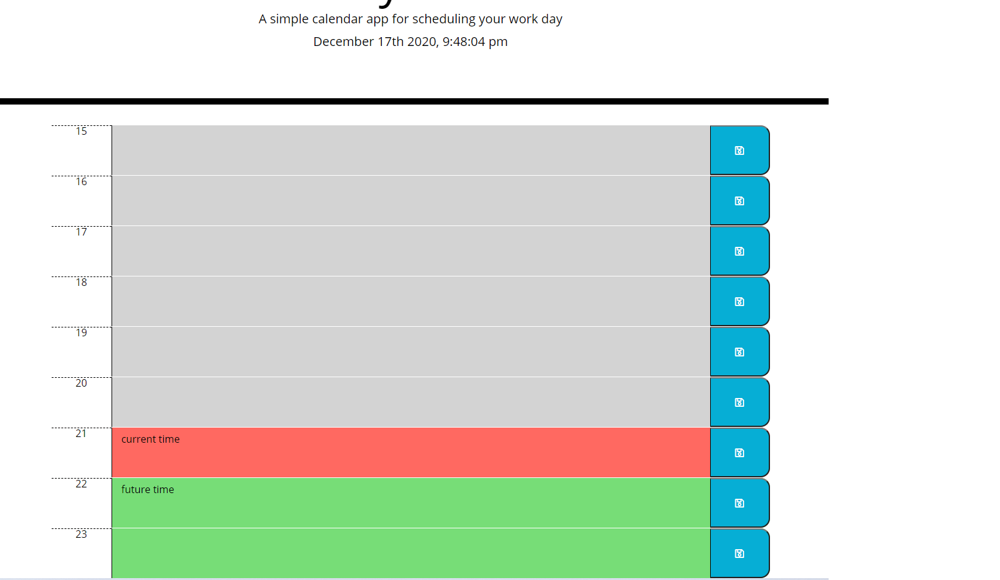

# api-day-planner

## Project Description "Work Day Scheduler!"

This simple calendar application that allows a user to save events for each hour of the day. This app will run in the browser and feature dynamically updated HTML and CSS powered by jQuery.
This work day scheduler uses [Moment.js] library to work with dates and times.

**Technologies used:** 
* HTML
* CSS
* moment.js
* jQuery
* Javascript
* API-DOM
* Bootstrap

### Research Link

* [Google](https://www.google.com)
* [w3school.com](https://www.w3schools.com/html/html5_semantic_elements.asp)
* [developer.mozilla.org](https://developer.mozilla.org/en-US/docs/Glossary/Semantics)
* [stackoverflow.com/](https://stackoverflow.com//)

### Application links

* [deployed application](https://mugich.github.io/api-day-planner/)

* [GitHub repositories](https://github.com/mugich/api-day-planner)

### Application's appearance

